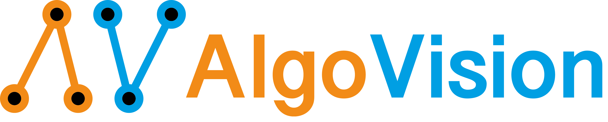

# AlgoVision - A Framework for Differentiable Algorithms and Algorithmic Supervision



This repository includes the official implementation of our NeurIPS 2021 Paper "Learning with Algorithmic Supervision via Continuous Relaxations"
(Paper @ [ArXiv](https://arxiv.org/pdf/2110.05651.pdf),
Video @ [Youtube](https://www.youtube.com/watch?v=01ENzpkjOCE)).

`algovision` is a Python 3.6+ and PyTorch 1.9.0+ based library for making algorithms differentiable. It can be installed via:
```shell
pip install algovision
```
Applications include smoothly integrating algorithms into neural networks for algorithmic supervision, problem-specific optimization within an algorithm, and whatever your imagination allows.
As `algovision` relies on PyTorch it also supports CUDA, etc. 

### [Check out the Documentation!](https://felix-petersen.github.io/algovision-docs/)

## 🌱 Intro

Deriving a loss from a smooth algorithm can be as easy as

```python
from examples import get_bubble_sort
import torch

# Get an array (the first dimension is the batch dimension, which is always required)
array = torch.randn(1, 8, requires_grad=True)

bubble_sort = get_bubble_sort(beta=5)
result, loss = bubble_sort(array)

loss.backward()
print(array)
print(result)
print(array.grad)
```

Here, the loss is a sorting loss corresponding to the number of swaps in the bubble sort algorithm.
But we can also define this algorithm from scratch:

```python
from algovision import (
    Algorithm, Input, Output, Var, VarInt,                                          # core
    Let, LetInt, Print,                                                     # instructions
    Eq, NEq, LT, LEq, GT, GEq, CatProbEq, CosineSimilarity, IsTrue, IsFalse,  # conditions
    If, While, For,                                                   # control_structures
    Min, ArgMin, Max, ArgMax,                                                  # functions
)
import torch

bubble_sort = Algorithm(
    # Define the variables the input corresponds to
    Input('array'),
    # Declare and initialize all differentiable variables 
    Var('a',        torch.tensor(0.)),
    Var('b',        torch.tensor(0.)),
    Var('swapped',  torch.tensor(1.)),
    Var('loss',     torch.tensor(0.)),
    # Declare and initialize a hard integer variable (VarInt) for the control flow.
    # It can be defined in terms of a lambda expression. The required variables
    # are automatically inferred from the signature of the lambda expression.
    VarInt('n', lambda array: array.shape[1] - 1),
    # Start a relaxed While loop:
    While(IsTrue('swapped'),
        # Set `swapped` to 0 / False
        Let('swapped', 0),
        # Start an unrolled For loop. Corresponds to `for i in range(n):`
        For('i', 'n',
            # Set `a` to the `i`th element of `array`
            Let('a', 'array', ['i']),
            # Using an inplace lambda expression, we can include computations 
            # based on variables to obtain the element at position i+1. 
            Let('b', 'array', [lambda i: i+1]),
            # An If-Else statement with the condition a > b
            If(GT('a', 'b'),
               if_true=[
                   # Set the i+1 th element of array to a
                   Let('array', [lambda i: i + 1], 'a'),
                   # Set the i th element of array to b
                   Let('array', ['i'], 'b'),
                   # Set swapped to 1 / True
                   Let('swapped', 1.),
                   # Increment the loss by 1 using a lambda expression
                   Let('loss', lambda loss: loss + 1.),
               ]
           ),
        ),
        # Decrement the hard integer variable n by 1
        LetInt('n', lambda n: n-1),
    ),
    # Define what the algorithm should return
    Output('array'),
    Output('loss'),
    # Set the inverse temperature beta
    beta=5,
)
```

### 👾 Full Instruction Set

<details>
  <summary>(<i>click to expand</i>)</summary>


The full set of modules is:
```python
from algovision import (
    Algorithm, Input, Output, Var, VarInt,                                          # core
    Let, LetInt, Print,                                                     # instructions
    Eq, NEq, LT, LEq, GT, GEq, CatProbEq, CosineSimilarity, IsTrue, IsFalse,  # conditions
    If, While, For,                                                   # control_structures
    Min, ArgMin, Max, ArgMax,                                                  # functions
)
```
`Algorithm` is the main class, `Input` and `Output` define arguments and return values, `Var` defines differentiable variables and `VarInt` defines non-differentiable integer variables.
`Eq`, `LT`, etc. are relaxed conditions for `If` and `While`, which are respective control structures.
`For` bounded loops of fixed length that are unrolled.
`Let` sets a differentiable variable, `LetInt` sets a hard integer variable. 
Note that hard integer variables should only be used if they are independent of the input values, but they may depend on the input shape (e.g., for reducing the number of iterations after each traversal of a For loop).
`Print` prints for debug purposes.
`Min`, `ArgMin`, `Max`, and `ArgMax` return the element-wise min/max/argmin/argmax of a list of tensors (of equal shape).

### λ Lambda Expressions

Key to defining an algorithm are `lambda` expressions (see [here](https://www.w3schools.com/python/python_lambda.asp) for a reference).
They allow defining anonymous functions and therefore allow expressing computations in-place.
In most cases in `algovision`, it is possible to write a value in terms of a lambda expressions.
The name of the used variable will be inferred from the signature of the expression.
For example, `lambda x: x**2` will take the variable named `x` and return the square of it at the location where the expression is written.

`Let('z', lambda x, y: x**2 + y)` corresponds to the regular line of code `z = x**2 + y`.
This also allows inserting complex external functions including neural networks as part of the lambda expression.
Assuming `net` is a neural networks, one can write `Let('y', lambda x: net(x))` (corresponding to `y = net(x)`).

### Let

`Let` is a very flexible instruction. The following table shows the use cases of it.

| AlgoVision                                    | Python                        | Description                       |
|-----------------------------------------------|-------------------------------|-----------------------------------|
| `Let('a', 'x')`                               | `a = x`                       | Variable `a` is set to the value of variable `x`. |
| `Let('a', lambda x: x**2)`                    | `a = x**2`                    | As soon as we compute anything on the right hand side of the equation, we need to write it as a `lambda` expression. |
| `Let('a', 'array', ['i'])`                    | `a = array[i]`                | Indexing on the right hand requires an additional list parameter after the second argument. |
| `Let('a', lambda array, i: array[:, i])`      | `a = array[i]`                | Equivalent to the row above: indexing can also be manually done inside of a `lambda` expression. Note that in this case, the batch dimension has to be written explicitly. |
| `Let('a', 'array', ['i', lambda j: j+1])`     | `a = array[i, j+1]`           | Multiple indices and `lambda` expressions are also supported. |
| `Let('a', 'array', [None, slice(0, None, 2)])`| `a = array[:, 0::2]`          | `None` and `slice`s are also supported. |
| `Let('a', ['i'], 'x')`                        | `a[i] = x`                    | Indexing can also be done on the left hand side of the equation. |
| `Let('a', ['i'], 'x', ['j'])`                 | `a[i] = x['j']`               | ...or on both sides. |
| `Let(['a', 'b'], lamba x, y: (x+y, x-y))`     | `a, b = x+y, x-y`             | Multiple return values are supported. |

In its most simple form `Let` obtains two arguments, a string naming the variable where the result is written, and the value that may be expressed via a `lambda` expression.

If the lambda expression returns multiple values, e.g., because a complex function is called and has two return values, the left argument can be a list of strings. 
That is, `Let(['a', 'b'], lamba x, y: (x+y, x-y))` corresponds to `a, b = x+y, x-y`.

`Let` also supports indexing. This is denoted by an additional list argument after the left and/or the right argument.
For example, `Let('a', 'array', ['i'])` corresponds to `a = array[i]`, while `Let('array', ['i'], 'b')` corresponds to `array[i] = b`.
`Let('array', ['i'], 'array', ['j'])` corresponding to `array[i] = array[j]` is also supported.

Note that indexing can also be expressed through `lambda` expressions.
For example, `Let('a', 'array', ['i'])` is equivalent to `Let('a', lambda array, i: array[:, i])`. Note how in this case the batch dimension has to be explicitly taken into account (`[:, ]`).
Relaxed indexing on the right-hand side is only supported through `lambda` expressions due to its complexity.
Relaxed indexing on the left-hand side is supported if exactly one probability weight tensor is in the list (e.g., `Let('array', [lambda x: get_weights(x)], 'a')`).

`LetInt` only supports setting the variable to an integer (Python `int`) or list of integers (as well as the same type via lambda expressions).
Note that hard integer variables should only be used if they are independent of the input values, but they may depend on the input shape.

> If you need help implementing your differentiable algorithm, you may [schedule an appointment](https://calendly.com/fpetersen/meeting). This will also help me improve the documentation and usability.

</details>

## 🧪 Experiments

The experiments can be found in the `experiments` folder. Additional experiments will be added soon.

### 🔬 Sorting Supervision

The sorting supervision experiment can be run with
```shell
python experiments/train_sort.py
```
or by checking out [this Colab notebook](https://colab.research.google.com/drive/1HYhbMh7hUyySOZqfQRlqxJhLQ_4_e5Fe?usp=sharing).

## 📖 Citing

If you used our library, please cite it as

```bibtex
@inproceedings{petersen2021learning,
  title={{Learning with Algorithmic Supervision via Continuous Relaxations}},
  author={Petersen, Felix and Borgelt, Christian and Kuehne, Hilde and Deussen, Oliver},
  booktitle={Conference on Neural Information Processing Systems (NeurIPS)},
  year={2021}
}
```

## 📜 License

`algovision` is released under the MIT license. See [LICENSE](LICENSE) for additional details.

