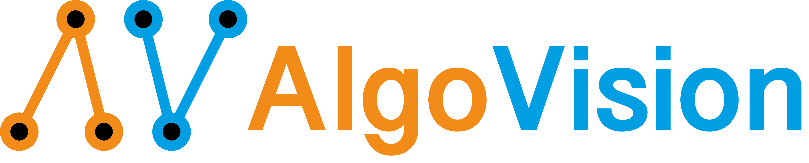

.. AlgoVision documentation master file, created by
   sphinx-quickstart on Sun Dec  5 16:56:51 2021.
   You can adapt this file completely to your liking, but it should at least
   contain the root `toctree` directive.

Welcome to the documentation of AlgoVision!
===========================================

A framework (or programming language) for smooth differentiable algorithms.
That is, algorithms which are differentiable wrt. decisions in the algorithm and
also differentiable wrt. indices used for indexing.

It is the official implementation of our NeurIPS 2021 Paper "Learning with Algorithmic Supervision via Continuous Relaxations"
(Paper @ `ArXiv <https://arxiv.org/pdf/2110.05651.pdf>`_ and
Video @ `Youtube <https://www.youtube.com/watch?v=01ENzpkjOCE>`_).

.. toctree::
   :glob:
   :maxdepth: 2
   :caption: Documentation

   notes/installation
   notes/basics
   notes/control_structures
   notes/integers_and_for
   notes/bubble_sort_example

.. toctree::
   :glob:
   :maxdepth: 2
   :caption: API

   api/core
   api/instructions
   api/control_structures
   api/conditions
   api/functions

Indices and tables
==================

* :ref:`genindex`
* :ref:`modindex`
* :ref:`search`
